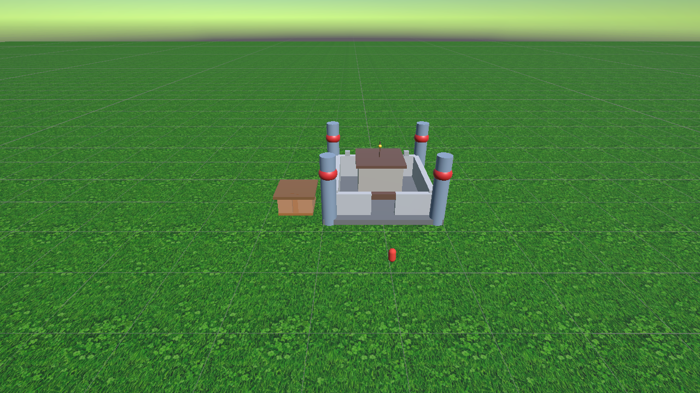

<div align="center">

# 🏰 AI Town

**用一句话，在引擎里长出一座城。**

Luanti Builder 核心能力的团结引擎（Unity）迁移演示：
自然语言生成建筑 · 带记忆的 AI NPC · 第一人称漫游小镇

   

</div>

---



> 运行时由 `castle.json` 动态生成的城堡白模 —— 编辑器里没有建筑，按 ▶️ Play 它才会"长"出来。

## ✨ 亮点

- 🪄 **一句话生成建筑**：Play 中按 `Tab` 呼出面板，输入「建一个红色大城堡」→ AI 生成 JSON → 城堡当场落地，门还朝着你（已端到端验证）
- 🧱 **JSON → 3D 建筑**：一份 JSON 就是一栋楼，`box / cyl / sphere / cone / pyramid / dome / arch / stairs` 8 种形状已实现，对标原项目 20 种形状命令
- 🚶 **第一人称漫游**：WASD + 鼠标；按 **F** 切换飞行模式鸟瞰小镇（含防晕动优化：速度平滑、俯仰渐变）
- 🤖 **AI 大脑外置**：大模型调用、建筑生成算法、NPC 记忆全部留在 Python 服务，引擎只做渲染与交互 —— 换模型不动客户端
- 🛠️ **一键搭场景**：菜单 `Tools → AI Town → Setup Main Scene`，地面/天空盒/光照/玩家全自动
- 🌱 **AI 生成材质**：地面草地贴图由文生图生成（2048×2048 无缝平铺）

## 🧠 架构

**核心策略：AI 大脑留在 Python，Unity 只做渲染和交互层。**

```text
┌──────────────────────┐                ┌──────────────────────┐
│   🐍 Python AI 大脑   │   HTTP/JSON    │  🎮 团结引擎 (Unity)   │
│   localhost:8765     │ ◄────────────► │                      │
│                      │                │                      │
│  • 建筑生成算法        │                │  • 3D 场景渲染        │
│    (23 模板 + AI)     │                │  • 第一人称漫游/飞行   │
│  • NPC 记忆系统       │                │  • 建筑生成面板 UI     │
│  • 对话提示词/反思     │                │  • 对话 UI/输入交互    │
└──────────────────────┘                └──────────────────────┘
```

**API 契约**（Python 端 `ai_town_server.py`）：

| 接口 | 说明 | 状态 |
|---|---|---|
| `POST /api/generate_json` | 输入建筑描述，返回建筑 JSON 方块列表 | ✅ 已上线 |
| `POST /api/npc/chat` | 发消息给 NPC，返回回复（带上下文记忆） | ⏳ Day 3 |
| `GET /api/npc/memory?name=xxx` | 查询某个 NPC 的记忆 | ⏳ Day 3 |

## 🚀 快速开始

```bash
git clone https://github.com/hhhh124hhhh/ai-town.git
```

**跑起来（Day1 能力）**

1. 用**团结引擎 2022.3.62t12**（或 Unity 2022.3 LTS）打开 `ai-town` 工程
2. 菜单 `Tools → AI Town → Setup Main Scene` 一键搭建主场景（含地面/天空盒/玩家出生点）
3. 按 ▶️ **Play**：
   - `WASD` 移动，鼠标转视角
   - `F` 切换飞行模式（无重力、加速），再按一次落地
4. 场景里的城堡/小屋由 `Assets/StreamingAssets/Buildings/*.json` 在 Play 时动态生成，改 JSON 即改建筑

**接入 AI 生成（Day2 能力）**

5. 启动 Python AI 服务（[Luanti Builder](https://github.com/cpufreestyle/luanti-builder) 工作目录下）：

   ```bash
   python ai_town_server.py   # 监听 http://localhost:8765
   ```

6. Unity Play 中按 `Tab` 呼出建筑面板 → 输入中文描述（如「建一个金色宝塔」）→ 回车生成
   - 面板内置 23 种建筑模板快捷按钮，一键秒出
   - 「清除」按钮清空场景建筑

## 📐 建筑 JSON 格式

```json
{
  "name": "红色城堡",
  "blocks": [
    { "shape": "box",      "pos": [0, 1, 0],  "size": [10, 5, 10], "color": "#8B4513" },
    { "shape": "cylinder", "pos": [-5, 0, -5], "size": [2, 8, 2],  "color": "#704214" }
  ]
}
```

- 坐标/尺寸直接沿用原项目体素坐标系，无需换算
- 支持的形状（对标原项目 20 种命令）：`box` `cyl` `sphere` `cone` `pyramid` `dome` `arch` `stairs` 已实现；`ring` `spiral` `line` `taper` 等按计划补全

## 🗺️ Roadmap

| 阶段 | 内容 | 状态 |
|---|---|---|
| **Day 1** | 白模场景 + JSON→建筑生成 + 第一人称漫游/飞行 | ✅ 完成 |
| **Day 2** | 对接 AI 建筑生成 `/api/generate_json` + Tab 建筑面板 + 形状补全 | ✅ 完成 |
| **Day 3** | AI NPC：带记忆对话 `/api/npc/chat`，面包师 & 守卫入驻 | ⏳ 计划 |
| **Day 4** | 整合演示场景 + 打磨 + 打包 | ⏳ 计划 |

## 📁 目录结构

```text
ai-town/
├── Assets/
│   ├── Scripts/
│   │   ├── Core/                     # BuildingData / BuildingManager / JsonLoader / ShapeFactory
│   │   │   └── Editor/               # AiTownSceneSetup / AiTownBakeBuildings（一键搭建/烘焙）
│   │   ├── API/                      # ApiClient（对接 Python 服务 /api/generate_json）
│   │   ├── UI/                       # BuildingPanel（Tab 面板：输入生成/模板/清除）
│   │   └── Player/                   # FlyMode（F 键飞行，含防晕动优化）
│   ├── SharedAssets/FirstPersonController/   # Starter Assets 第一人称控制器
│   ├── StreamingAssets/Buildings/    # castle.json / hut.json（运行时建筑数据）
│   └── Textures/Ground/              # AI 生成草地贴图
├── Docs/                             # 迁移开发文档（873 行完整设计文档）
└── ProjectSettings/
```

## 🔧 协作提示

本仓库配置了 `.gitattributes`：场景/预制体/材质等 Unity YAML 资产按**文本 3-way 合并**（git 原生），图片/模型/音频等二进制资产严格禁止行尾与编码转换。

> 团结引擎自带的 `TuanjieYAMLMerge.exe` 经实测不满足 git merge driver 协议（结果仅输出到 stdout、真冲突退出码仍为 0），故未启用，避免静默丢失对方改动的风险。多人协作时建议按 prefab 拆分场景，避免两人同时编辑同一 `.unity` 文件。

## 🙏 致谢与参考

- **[Luanti Builder](https://github.com/cpufreestyle/luanti-builder)**（cpufreestyle / MichaelQiu）—— 自然语言生成 3D 沙盒建筑的跨平台工具，本项目的能力来源与迁移蓝本
- **[Unity Starter Assets - First Person](https://assetstore.unity.com/packages/essentials/starter-assets-firstperson-character-controller-196525)** —— 第一人称控制器
- **[团结引擎 Tuanjie](https://unity.cn/tuanjie)** —— Unity 中国版引擎
- 完整迁移设计文档见 [`Docs/LuantiBuilder迁移开发文档.md`](Docs/LuantiBuilder迁移开发文档.md)
