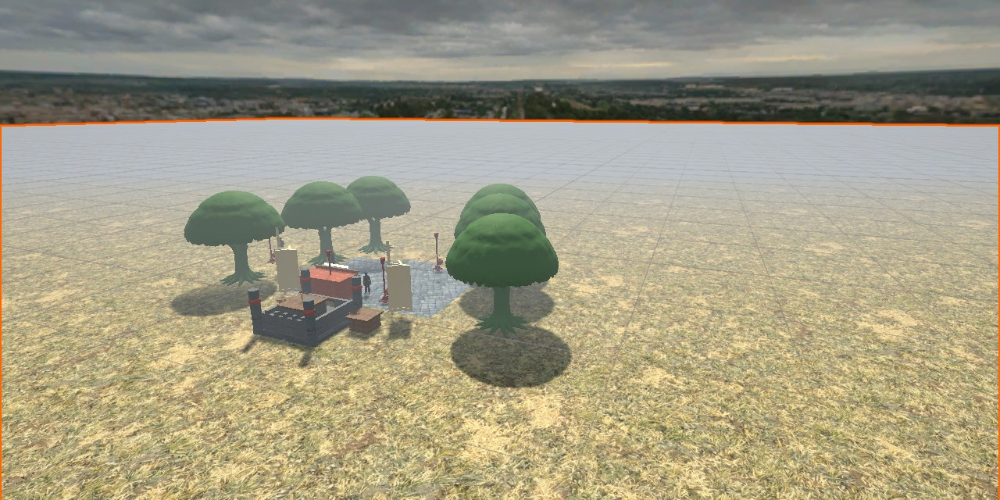
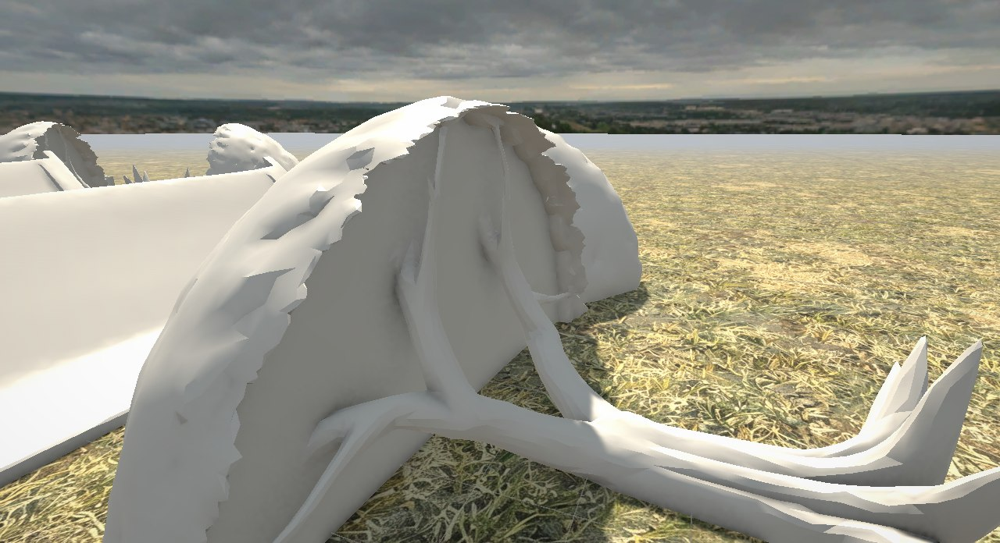
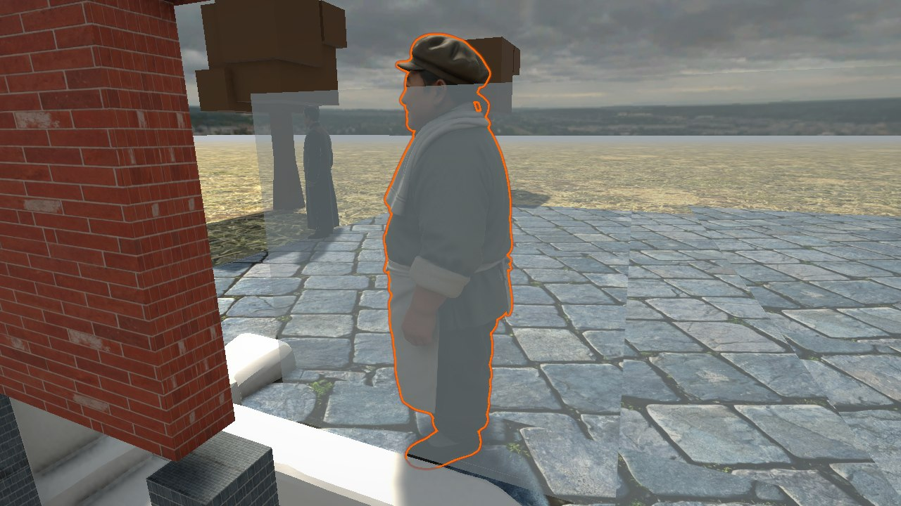
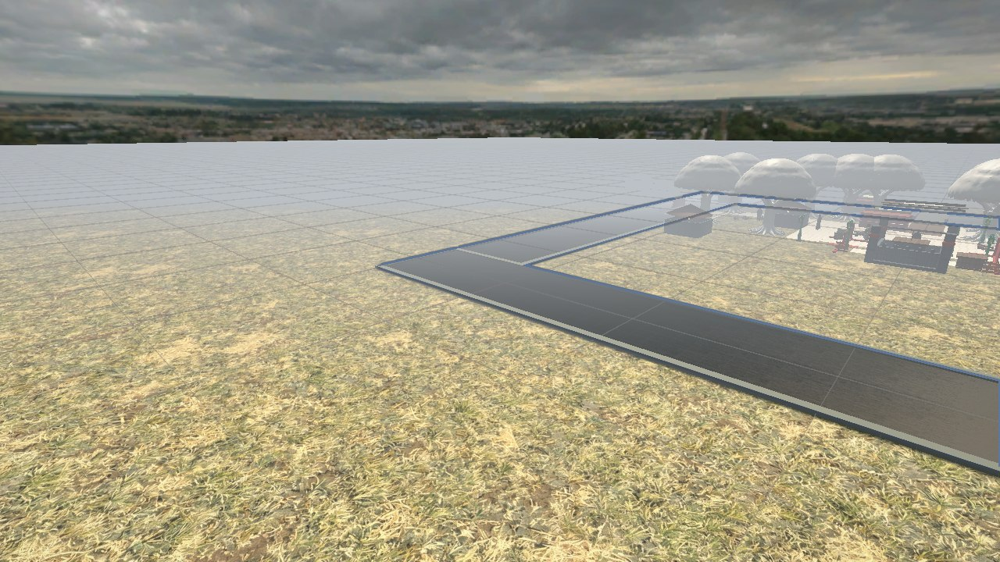

<div align="center">



# 🏮 AI 小镇 · 说出愿望，落地成真

**一座会记住你的小镇 —— 你说一句话，它就长出一栋楼。**

`#shenicest-fission`

巡逻的巡捕记得你昨晚在街角起的骑楼，茶馆掌柜嫌你的桥太窄，
而小镇从「荒地聚落」一路长成「传奇之城」——砖瓦全是你嘴上说出来的。

     

</div>

> 封面是镇中心的黄昏实拍（青砖洋楼 + 骑楼街 + 牌坊 + 护城河）。编辑器里没有建筑不代表小镇是空的 —— 按 ▶️ Play，它会自己"长"出来。

---

## 🎮 这是什么

**一句话**：第一人称漫游的民国小镇，玩家用**自然语言**盖楼，接 **NPC 委托**赚大洋，把一片荒地建成传奇之城。

它是 [Luanti Builder](https://github.com/cpufreestyle/luanti-builder) 核心能力（自然语言 → 3D 建筑）向团结引擎（Unity）的迁移与游戏化 —— 从"能生成建筑的 HTML 面板演示"，变成"有开场、有目标、有反馈、有记忆的游戏"。

| 三件事 | 玩家体验 |
|---|---|
| 🗣️ **说句话就起楼** | 「建一个红色大城堡」→ 秒后城堡落地，门还朝着你 |
| 🧠 **NPC 记得你做过什么** | 交付后找他搭话，他会主动提你盖的那座楼 |
| 📈 **小镇随你长大** | 繁荣度五级：荒地聚落 → 边陲小村 → 热闹小镇 → 繁荣市镇 → 传奇之城 |

---

## 🔁 核心循环

```
找 NPC 接委托 → 按 Tab 说出建筑 → 绿圈内选址放置 → 按 C 提交验收 → 拿大洋/升繁荣/解模板 → NPC 记住这一单
      ↑______________________________ 越建越会挑（占地/方块数/距离 四道判据）______________________↓
```

1. **接单** — `E` 跟掌柜/巡捕搭话，或 `C` 开委托大厅看详情。开局不给任务：得你自己去问。
2. **建造** — `Tab` 呼出面板，一句话生成（或点 28 种模板按钮）。随后进入**选址模式**：半透明幽灵跟着准星走，压到建筑就变红，`左键`落定、`R` 转 90°、`滚轮`微调。
3. **落位** — 委托会在镇上标出一片**绿色作业圈**（半径最大 25 m，自动避开已有建筑）。世界里的墨色箭头指路、HUD 报方位距离、落成后顶部弹提示条 —— 三层引导，不至于站着转圈找不着北。
4. **验收** — 圈里 `C` 提交。服务端按**类型 / 占地 / 方块数 / 距委托人远近**四条硬规则判分，评 `S`（金）或 `A`（绿），全屏闪光 + 庆典纸屑 + 大洋数字弹跳；不达标打回重做。
5. **成长** — 大洋与繁荣度入账，高级模板按委托与里程碑解锁（风车 / 灯塔 / 关帝庙 / 戏台 / 鼓楼 / 牌坊 / 摩天楼 / 飞船 / 沪上高楼）。判分是确定性规则，**LLM 只负责说话**：发单话术和角色化点评，所以演示不会因模型抽风而崩。

---

## ⌨️ 操作一览

| 键 | 作用 | 键 | 作用 |
|---|---|---|---|
| `WASD` | 移动 | `Tab` | 建造面板（AI 生成 / 模板） |
| `鼠标` | 视角 | `C` | 委托大厅 + 提交验收 |
| `F` | 飞行模式（可穿云，撞墙挡得住） | `E` | 与 NPC 对话 |
| `U` | 撑开 / 收拢油纸伞 | `X` | 回出生点（脱困保险） |
| `左键 / 右键` | 放置 / 取消（选址中） | `Esc` | 关闭一切面板 |
| `R` / `滚轮` | 旋转 90° / 微调 15°（选址中） | `任意键` | 跳过开场演出 |

> 打字门控做过专门处理：打拼音时 `Enter`/`Tab`/`Esc` 不会误触发游戏指令，点过按钮后 `E`/`X` 也不会被焦点吃掉。

---

## 🧑‍🤝‍🧑 镇上的四个人

| NPC | 身份 | 干什么 |
|---|---|---|
| **面包师老王** | 茶馆掌柜（烧饼 + 茶） | 发 5 张委托：烤炉房、香料花园、老磨坊、喷泉、运货小桥 |
| **守卫铁山** | 租界巡捕（巡逻三十年） | 发 5 张委托：瞭望塔、巷口灯塔、关帝庙…… |
| **王婶** | 骑楼住户 | 聊天、见证小镇变化 |
| **钱先生** | 镇上体面人 | 聊天 |

每人有独立人格与记忆窗口（最近 50 条），交付记录会写进他的记忆 —— 你隔天再问他"我刚才做了什么"，他答得上来。没有 API Key 时走角色化离线回退，对话不会空。

---

## 🌆 画面与演出

- **开场即主菜单**（不做传统菜单页）：黑纱透出黄昏小镇 → 宣纸信笺浮入 → **AI 现场书写**开场白打字机（打完盖朱红印章 + 屏震 + 金光迸溅，落款"本句由 AI 现场书写 · 耗时 x.x 秒"——把模型延迟变成卖点）→ 高空环绕同时建筑逐块生长 → 锣声低空掠过广场 → 俯冲交还控制权。全程约 11 秒，任意键可跳。
- **黄昏定妆**：夕阳暖橙主光 + 9 盏路灯点光 + 篝火闪烁 + 暖雾（28–75 m）+ ACES 色调与 Bloom，天空盒以 0.6°/s 缓转，云一直在走。
- **粒子与音效**：建造落地起尘、交付纸屑、委托里程碑落尘、烟囱青烟、萤点烛光；音效走 `Resources/Audio/`，缺失自动跳过。
- **民国 UI 设计系统**：宣纸 / 墨 / 淡墨 / 朱红四角色 token + 三态按钮 + 9-slice 组件（AI 生图拆层后处理而得），全局按屏高缩放，楷体双语角色。所有面板走同一套，不现场发明样式。
- **美术资产本身也大量由 AI 生产**：青砖/红砖/木板/夯土/草地无缝贴图、民国天空盒、道具模型、粒子音效，见 [`Docs/3D物品清单.md`](Docs/3D物品清单.md)。

## 📸 实拍

| 镇貌全景 | 街上会遇见人 | 护城河与石桥 |
|---|---|---|
|  |  |  |

---

## 🧠 怎么实现的

**核心策略：AI 大脑留在 Python，引擎只做渲染与交互。** 换模型不动客户端，判分逻辑可单测。

```
┌────────────────────────┐                    ┌────────────────────────┐
│  🐍 Python AI 后端      │   HTTP/JSON        │  🎮 团结引擎客户端       │
│  localhost:8765         │ ◄────────────────► │                        │
│  nlp.py    中文解析      │                    │  BuildingManager 几何生成│
│  json_gen  28 类建筑     │                    │  ShapeFactory  8 种形状  │
│  npc_ai    记忆对话      │                    │  CommissionSystem 玩法  │
│  commission_ai 规则判分  │                    │  CinematicIntro  演出   │
│  state.json 进度落盘     │                    │  UiTheme       民国 UI  │
└────────────────────────┘                    └────────────────────────┘
```

| 接口 | 用途 |
|---|---|
| `POST /api/generate_json` | 描述或模板 → 建筑 JSON（方块列表） |
| `POST /api/npc/chat` · `GET /api/npc/memory` · `GET /api/npc/list` | NPC 记忆对话 |
| `POST /api/commission/new` · `submit` · `abandon` · `GET /api/commission/state` | 委托发单 / 验收判分 / 状态 |
| `GET /api/intro/line` | 开场白（AI 现写，离线回退固定句） |
| `GET /api/health` | 探活 + LLM 通道状态 |

**建筑 JSON 契约**（坐标直接沿用体素系，Unity 与 Luanti 同为 Y 上、1 格 = 1 米，无需换算）：

```json
{
  "name": "红色城堡",
  "blocks": [
    { "shape": "box",      "pos": [0, 1, 0],   "size": [10, 5, 10], "color": "#8B4513" },
    { "shape": "cylinder", "pos": [-5, 0, -5], "size": [2, 8, 2],   "color": "#704214" }
  ]
}
```

形状：`box` `cyl` `sphere` `cone` `pyramid` `dome` `arch` `stairs`；改 `Assets/StreamingAssets/Buildings/*.json` 即改镇上的房子。

---

## 🚀 跑起来

```bash
git clone https://github.com/hhhh124hhhh/ai-town.git
```

1. 用**团结引擎 2022.3.62t12**（或 Unity 2022.3 LTS）打开 `ai-town` 工程 —— 远程桌面/虚拟机下启动加 `-force-d3d12`
2. 菜单 `Tools → AI Town → Setup Main Scene` 一键搭好地面 / 天空盒 / 玩家（首次）
3. 按 ▶️ **Play** —— AI 后端会由 `ServerBootstrap` 自动拉起，无需手动开服务
4. 开场演出一按任意键结束，你就在镇口了：`E` 找老王接一单，`Tab` 说句话试试

**可选**：想让 NPC 真的"活"，配好 DeepSeek Key 再启动游戏（会被后端子进程继承）：

```bash
set DEEPSEEK_API_KEY=sk-xxx      # Windows；或用 server/llm_config.json 覆盖
ai-town\server\start_server.bat  # 想手动起服务就走这条
```

没 Key 也能跑通全流程（对话/开场白/委托点评全部走离线回退），只是文案固定。委托进度落盘在 `server/state.json`，服务重启不丢单；但**开局不自动派单** —— 设计上就得玩家自己去找 NPC 接。

---

## 🗺️ 现在到哪了

| 里程碑 | 内容 | 状态 |
|---|---|---|
| M1 | 白模场景 + JSON→建筑 + 第一人称/飞行 | ✅ |
| M2 | 对接 AI 生成 + 建造面板 + 形状补全 | ✅ |
| M3 | AI NPC 记忆对话全链路 | ✅ |
| M4 | 民国换皮（建筑/道具/天空/雾/UI）+ 黄昏光照 + 特效粒子 + 开场演出 | ✅ |
| M5 | 玩法层：委托建造循环 + 三层引导 + 状态落盘 + 打字门控 | ✅ |
| M6 | Windows 打包 + 演示彩排（含招牌写字、性能收敛） | 🚧 进行中 |

已知待办与性能账（场景 113.6 万三角，UCDC 满分线 5 万）见 [`flow/plan.md`](flow/plan.md) 与 [`flow/进展.md`](flow/进展.md) 顶部交接棒。

## 📁 仓库结构

```text
ai-town/
├── Assets/
│   ├── Scripts/
│   │   ├── Core/          # BuildingManager / ShapeFactory / MaterialLibrary
│   │   │   └── Editor/    # 搭场景、烘焙、摆道具、PlacementLint 校验等幂等菜单
│   │   ├── API/           # ApiClient（对接 Python 后端）
│   │   ├── UI/            # UiTheme 设计系统 / BuildingPanel / DialogSystem / UiPanelLayout
│   │   ├── Commission/    # CommissionSystem（HUD + 大厅 + 绿圈 + 验收高光）
│   │   ├── Player/        # FlyMode / PlayerBounds / HeldItemUmbrella
│   │   └── NPC/           # NPCController（名牌、气泡、就近交互）
│   ├── StreamingAssets/Buildings/   # castle / hut / qilou JSON
│   ├── Resources/                   # UI v2 组件 / 字体 / 音效 / 特效 / 建筑贴图
│   └── Scenes/Main.unity            # 镇子本体
├── server/               # Python AI 后端（nlp / json_gen / npc_ai / commission_ai）
├── Docs/                 # 验收标准 / 3D 物品清单 / UI kit 预览 / 迁移设计文档
└── flow/                 # 协作控制层：进展(交接棒) / 计划 / 决策 / 踩坑 / 任务卡
```

## 🤝 协作约定

本仓库自带一套多 Agent 协作流程：**开工先读 [`flow/进展.md`](flow/进展.md) 顶部交接棒**，合同在 [`AGENTS.md`](AGENTS.md)，任务契约在 [`flow/plan.md`](flow/plan.md)。收工在进展日志顶部追加一条。

`.gitattributes` 把 Unity YAML 资产按文本 3-way 合并、二进制严格禁转换。团结引擎自带的 `TuanjieYAMLMerge.exe` 实测不满足 git merge driver 协议（结果只打 stdout、真冲突退出码仍为 0），故**未启用**，以免静默丢改动；场景只能单线推进，每块完成即提交检查点。

## 🙏 致谢

- **[Luanti Builder](https://github.com/cpufreestyle/luanti-builder)**（cpufreestyle / MichaelQiu）—— 自然语言生成 3D 沙盒建筑，本项目的能力来源与迁移蓝本
- **[Unity Starter Assets – First Person](https://assetstore.unity.com/packages/essentials/starter-assets-firstperson-character-controller-196525)** —— 第一人称控制器
- **[团结引擎 Tuanjie](https://unity.cn/tuanjie)** + TJGenerators（AI 生图 / 生模型 / 生音效 / 粒子效果库）—— 本项目的资产与音乐音效大量由其生产
- 完整迁移设计文档：[`Docs/LuantiBuilder迁移开发文档.md`](Docs/LuantiBuilder迁移开发文档.md)
